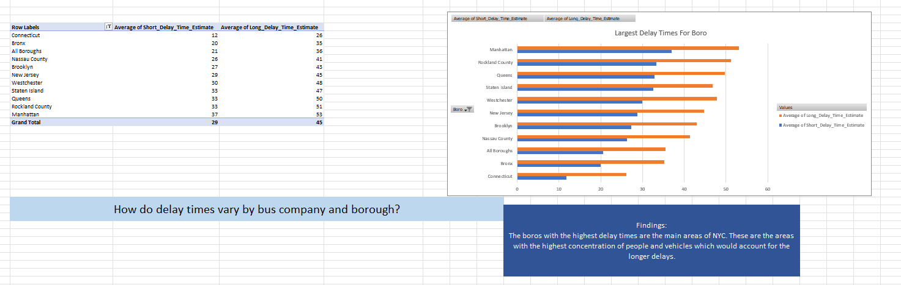
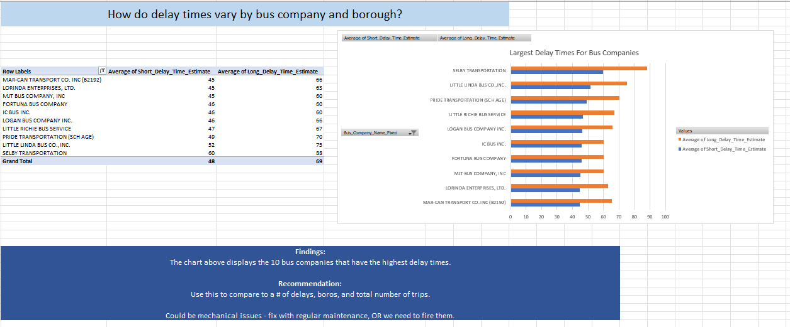

# Delay Times by Bus Company and Borough

This analysis focuses on the variation in delay times by different bus companies and boroughs in New York City. By understanding the average short and long delay times, we can identify areas and companies with significant delay issues.

## Borough-Specific Delays
The analysis reveals that boroughs like **Manhattan** and **Rockland County** experience the longest delay times. These boroughs are key areas with high traffic and concentration of vehicles, leading to more delays.

### Findings:
- **Longest Delays**: Manhattan and Rockland County show the longest average delay times, both in short and long delays.
- **Recommendation**: Target these boroughs for transportation infrastructure improvements and enhanced vehicle maintenance.

## Bus Company-Specific Delays
We also analyzed delay times by bus company, identifying the companies that experience the longest delays. Bus companies like **Selby Transportation** and **Little Linda Bus Co.** show the highest average long delay times, which may indicate mechanical or operational inefficiencies.

### Findings:
- **Top 3 Companies with Longest Delays**: 
  1. **Selby Transportation**: Highest average long delay time.
  2. **Little Linda Bus Co.**: Consistently experiences longer delays.
  3. **Pride Transportation**: Also shows significant long delay times.

### Recommendation:
- Investigate mechanical issues or operational inefficiencies for the bus companies with the longest delays. 
- Compare the number of delays with the number of trips and consider whether certain bus companies need operational changes or stricter maintenance schedules.

